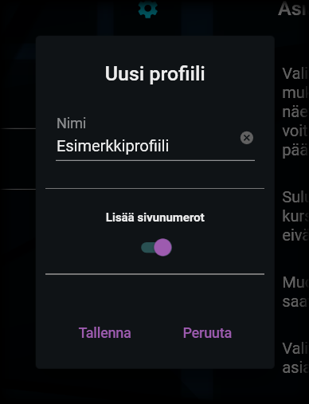

# Profiilien yleiset toiminnot

---

## Yleisten toimintojen valikko

Yleisten toimintojen valikko

Profiilien yleisten toimintojen valikon saat avattua painamalla profiilin valintavalikon vasemmalla puolella olevaa kuvaa asiakirjasta, jossa on pieni +-merkki. Valikosta löydät seuraavat toiminnot:

### 1. Uusi profiili

Uuden profiilin tiedot

Uuden profiilin luomista varten sinun on syötettävä profiilin nimi ja valittava, lisätäänkö sen avulla luotavaan asiakirjaan sivunumerot.

Nimi ei voi olla tyhjä eikä se voi olla sama, kuin toisella, jo olemassa olevalla profiililla. Sovellus ilmoittaa, jos nämä kriteerit eivät täyty.

Tallentamalla uusi profiili lisätään profiilien valikkoon. Uusi profiili on tyhjä eli se ei sisällä lainkaan osioita, vaan ne on lisättävä käyttäjän toimesta erikseen.

### 2. Profiilin kopioiminen

Kopioitavan profiilin tiedot

Profiili on mahdollista kopioida uudeksi profiiliksi. Kopioiminen kopioi aikaisemmalta profiililta kaikki tiedot, mukaan lukien sen sisältämät osiot ja niiden tiedot. Kopioimalla luotavalla profiililla on oltava eri nimi, kuin alkuperäisellä (sovellus ehdottaa nimeksi aikaisempaa nimeä lisättynä lisätiedolla "(Kopio)").

Järjestelmänvalvoja on saattannut asennuspaketin mukana toimittaa sellaisia valmiita profiileja, jotka [eivät ole muokattavissa](general.md#esiasennetut-koontiprofiilit). Tällaisen profiilin voi kuitenkin kopioida uudeksi profiiliksi, jota puolestaan on mahdollista muokata. Näin ollen voit luoda myös omia versioitasi lukituista profiileista.

### 3. Profiilin tuominen

Profiileita on mahdollista tuoda erillisistä tiedostoista. Näin ollen on esimerkiksi mahdollista jakaa organisaation sisällä erilaisia hyväksi havaittuja profiileja myös muiden käyttöön.

Profiilitiedostot tunnistat tiedostopäätteestä .opusprofile.

### 4. Profiilin vieminen

Vastaavasti kuin profiileita on mahdollista tuoda sovellukseen, niitä on mahdollista myös viedä siitä tiedostoiksi. Vietäessä profiili, valitse sille nimi. Profiili tallennetaan valitsemaasi paikkaan .opusprofile -päätteisenä tiedostona ja se on sieltä mahdollista kopioida tai siirtää edelleen haluamaasi sijaintiin.

---

> "Bernard! Don't be a tuna head!" - Dr. Fred
