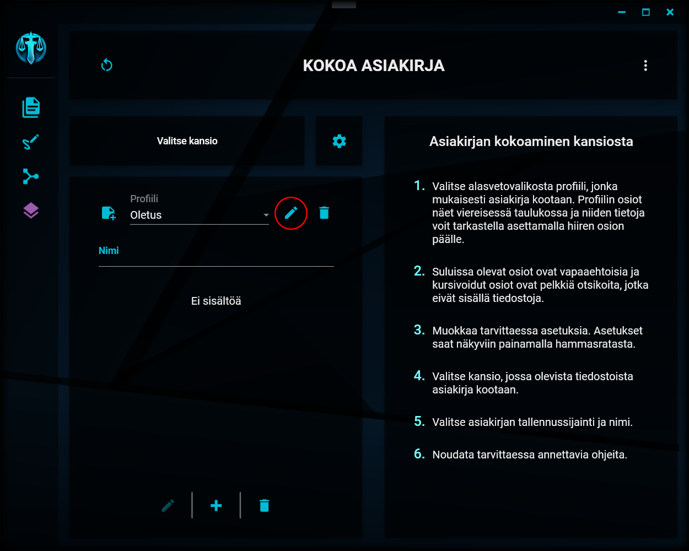

# Profiilin muokkaaminen

---

## Muokkaamispainike

Profiilin muokkaamisen painike

Valittua profiilia voit muokata painamalla profiilien valikon oikealla puolella olevaa painiketta, jossa on kynän kuva.

Muokkaaminen on mahdollista vain, jos profiilia ei ole järjestelmänvalvojan toimesta (tai muusta syystä) lukittu.

## Muokkausvalinnat

Profiilin muokkaamisen valinnat

Muokattaessa profiilia vaaditaan samat tiedot, kuin [luotaessa uutta profiilia](profile_actions.md#1-uusi-profiili). Tallennettaessa valitun profiilin tiedot muutetaan.

---

> "Some trees flourish, others die. Some cattle grow strong, others are taken by wolves. Some men are born rich enough and dumb enough to enjoy their lives. Ain't nothing fair. You know that." - John Marston
