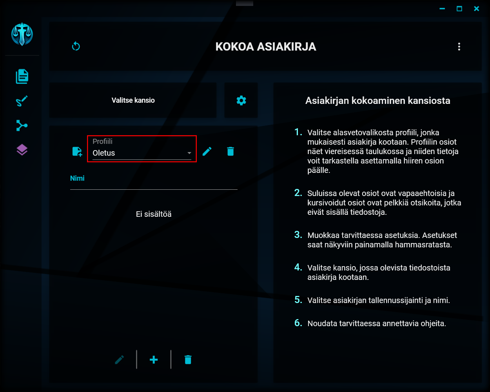

# Profiilin valitseminen

---

Profiilien valikko

Asiakirjan kokoamiseen käytettävän profiilin saat valittua näkymän keskivaiheilla olevasta alasvetovalikosta. Profiili määrittää sen, mitä asiakirjoja valitusta kansiosta etsitään, miten ne nimetään ja missä järjestyksessä ne kootaan. Lisäksi profiili määrittää sen, lisätäänkö tuotettavaan asiakirjaan sivunumerot.

On siis mahdollista luoda useita eri profiileita erilaisia asiakirjoja varten.

---

> "The executive restroom has been missing for weeks." - D. Rodriguez
