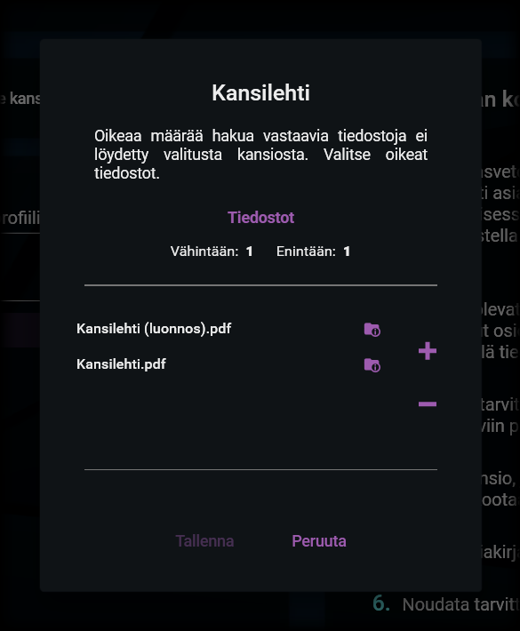
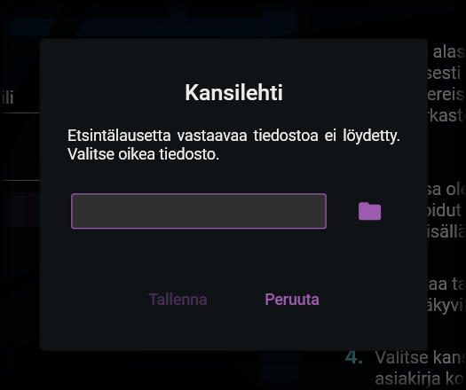

# Tallentaminen

---

## Kansion valinta

Koottavan kansion valinta

Asiakirjan kokoaminen tapahtuu valitussa kansiossa (ja mahdollisesti sen alikansioissa) sijaitsevista tiedostoista. Koottavan kansion valitseminen tapahtuu Valitse kansio -painikkeella. Klikkaamalla kyseistä painiketta avautuu Windowsin kansionvalintaikkuna. Valitse kansio, joka sisältää lopputuotteeseen koottavat asiakirjat.

Kun olet valinnut kansion, kokoaminen aloitetaan. Mikäli tiedostoja löydetään profiilin osioissa määritellyt määrät eikä muitakaan ongelmia ilmene, sinulta kysytään suoraan tallennettavan tiedoston nimeä ja polkua. Oletusarvoinen tiedoston nimi on kansion nimi sekä pääte ".pdf".

Jos tiedostoja ei kokoamisen aikana ole löytynyt oikeita määriä (esimerkiksi tiedostojen nimissä olevien kirjoitusvirheiden vuoksi), saatat nähdä seuraavia kyselyitä:

### 1. Usean tiedoston valinta

Usean tiedoston valinnan ikkuna

Tämä ikkuna näytetään seuraavissa tilanteissa:

- Osio hyväksyy vain yhden tiedoston, mutta etsintäkriteerillä on löydetty useita tiedostoja (esim. "Kansilehti.pdf" ja "Kansilehti (luonnos).pdf").
- Osio hyväksyy useita tiedostoja, mutta etsintäkriteerillä on löydetty liikaa tai liian vähän tiedostoja.

Hyväksytty tiedostojen määrä näytetään tiedostolistauksen yläpuolella, jossa on mainittu tiedostojen vähimmäis- ja enimmäismäärät.

Mikäli löydettyjä tiedostoja on liikaa, valitse väärät tiedostot ja klikkaa miinusmerkkiä niin, että tiedostoja jää jäljelle hyväksytty määrä. Mikäli tiedostoja on liian vähän, klikkaa +-merkkiä ja lisää tiedostoja niin, että niitä on oikea määrä. Klikkaa sitten Tallenna.

### 2. Yhden tiedoston valinta

Yhden tiedoston valinnan ikkuna

Tämä ikkuna näytetään, kun osio hyväksyy tasan yhden tiedoston, mutta etsintäkriteerillä ei ole löytynyt yhtään tiedostoa.

Etsi oikea tiedoston klikkaamalla kansion kuvaa. Kun olet valinnut tiedoston, saat tarkasteltua sitä klikkaamalla tiedoston nimeä. Oikean tiedoston valitsemisen jälkeen klikkaa Tallenna-painiketta.

## Kokoamisen valmistuminen

Kokoamisen valmistuminen

Kun asiakirjan kokoaminen on valmistuu, siitä ilmoitetaan erillisellä ikkunalla. Voit nyt sulkea ikkunan ja tarkastella tuotettua tiedostoa.

---

> "If our lives are already written, it would take a courageous man to change the script." - Alan Wake
