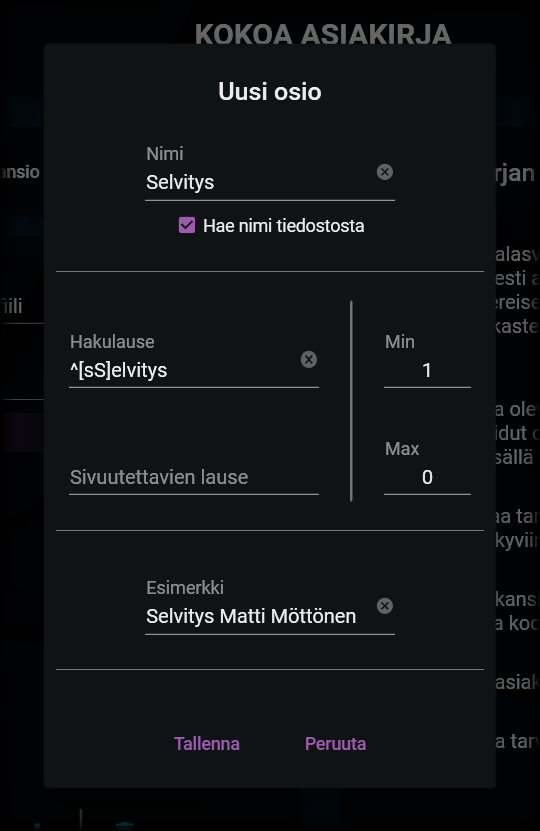

# Uuden osion luominen

---

## Osion lisääminen

<details>
<summary>Osion lisääminen</summary>
<div class="accordioncontent">


</div>
</details>

Saat lisättyä uuden osion profiiliin painamalla näkymän alalaidassa olevaa +-painiketta.

Aukeavasta valikosta voit valita uuden tiedosto-osion tai otsikko-osion. Näiden osioiden luominen on selostettu seuraavana.

## Otsikko-osio

<details>
<summary>Otsikon tiedot</summary>
<div class="accordioncontent">


</div>
</details>

Otsikot toimivat profiilin perusteella koottavan asiakirjan [yläotsikoina](general.md#profiilit-ja-osiot). Otsikolle ei vaadita muita tietoja, kuin sen nimi (eli se kirjanmerkin nimi, joka otsikon perusteella tuotetaan asiakirjaan - esimerkiksi "Liitteet").

Otsikko lisätään listaan viimeiseksi, josta se voidaan siirtää haluttuun kohtaan profiilin osioita.

## Tiedosto-osio

<details>
<summary>Tiedoston tiedot</summary>
<div class="accordioncontent">



</div>
</details>

Tiedosto-osion perusteella haetaan koottavaan asiakirjaan [tiedostoja valitusta kansiosta](general.md#profiilit-ja-osiot). Tiedosto-osio sisältää seuraavat kentät:

### 1. Nimi

Tiedoston nimi näytetään profiilin osioiden listassa. Nimeä käytetään myös lopputuotteessa kirjanmerkin nimenä löydetylle tiedostolle, ellei ruutuun "Hae nimi tiedostosta" ole laitettu rastia. Mikäli nimen hakeminen tiedostosta on valittu, tuotetaan kirjanmerkille nimi tiedoston mukaan.

**Esimerkki**

Kansiorakenteessa on tiedosto, jonka nimi on:

```bat
Liite 1, Kuitti.pdf
```

Profiiliin on lisätty osio, jonka nimi on:

```bat
Liite
```

_Vaihtoehto 1_

Tiedosto-osiolle _ei_ ole valittu nimen hakemista tiedostosta.

Lopulliseen tiedostoon tuotettavan kirjanmerkin nimi kyseiselle tiedostolle on:

```bat
Liite
```

_Vaihtoehto 2_

Tiedosto-osiolle _on_ valittu nimen hakeminen tiedostosta.

Lopulliseen tiedostoon tuotettavan kirjanmerkin nimi kyseiselle tiedostolle on:

```bat
Liite 1, Kuitti
```

### 2. Hakulause

Hakulause on [säännöllinen lauseke](general.md#periaatteet-pääpiirteissään), jonka perusteella tiedostoa tai tiedostoja haetaan kansiorakenteesta. Esimerkiksi seuraava lauseke hakee kaikkia sellaisia tiedostoja, joiden nimi alkaa sanalla "liite" (kirjoitettuna isolla tai pienellä kirjaimella):

```
^[lL]iite
```

### 3. Sivuutettavien lause

Tämä lauseke toimii vastaavasti kuin hakulause, mutta tämän lausekkeen mukaista sisältöä _ei_ oteta huomioon silloin, kun hakulausetta verrataan tiedostojen nimiin. Esimerkiksi seuraava lauseke ei huomioi tiedoston nimissä mitään merkkejä ennen varsinaisia kirjaimia:

```
^[^a-zA-ZåäöÅÄÖ]*
```

**Esimerkki**

Edeltävän hakulauseen ja sivuutettavien lauseen yhdistelmä löytäisi esimerkiksi kaikki seuraavat tiedostot:

```bat
liite.pdf
Liite.pdf
1. Liite.pdf
1 liite.pdf
12345_33 Liite.pdf
3.     Liite.pdf
*?!#33 liite 4 valokuvat.pdf
1111Liite.pdf
```

Yhdistelmä ei puolestaan löytäisi seuraavia tiedostoja:

```bat
Liiiite.pdf
liitte.pdf
A Liite.pdf
```

### 4. Minimimäärä

Minimäärällä määritellään se, paljonko tiedostoja on vähintään löydyttävä, jotta kokoaminen hyväksytään. Jos määrä on esimerkiksi 3, kokoaminen ei onnistu, ennen kuin kolme tiedostoa on löydetty annetuilla kriteereillä. Tällöin käyttäjää kehotetaan osoittamaan puuttuvat tiedostot.

Jos minimääräksi asetetaan 0, tiedosto on vapaaehtoinen. Määritetyt kriteerit täyttävät tiedostot liitetään osaksi lopputuotetta, jos sellaisia löydetään.

### 5. Maksimimäärä

Maksimimäärä määrittää sen, paljonko tiedostoja hyväksytään liitettäväksi lopputuotteeseen. Mikäli kriteerit täyttäviä tiedostoja löytyy enemmän, kuin sallittu määrä, käyttäjää pyydetään valitsemaan ne tiedostot, jotka asiakirjaan liitetään.

Jos maksimimääräksi asetetaan 0, liitettävien tiedostojen määrää ei ole rajoitettu, vaan kaikki löydetyt ja kriteerit täyttävät tiedostot liitetään osaksi asiakirjaa.

Maksimimäärä ei voi olla pienempi, kuin minimimäärä.

### 6. Esimerkkinimi

Esimerkki-kohta ei ole pakollinen, mutta siihen voi syöttää esimerkin siitä, miten tiedosto annettujen kriteerien mukaan tulisi nimetä. Edellisiä kohtia mukaillen esimerkkinimi voisi olla vaikka "Liite 1, Kuvat.pdf".

## Tallentaminen

Kun osio tallennetaan, se lisätään profiilin osioiden listaan viimeiseksi. Sieltä se voidaan siirtää haluttuun kohtaan ja järjestää muiden osioiden kanssa.

---

> "That's the second biggest \[object\] I've ever seen!" - Guybrush Threepwood
