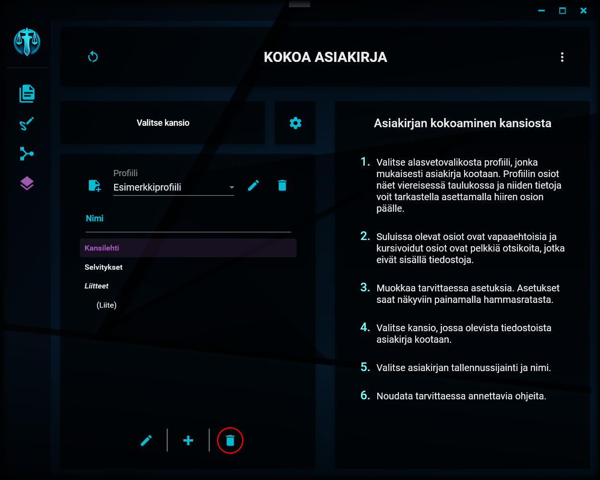

# Osion poistaminen

---

Osion poistamisen painike

Valitsemasi osion saat poistettua painamalla näkymän alalaidassa olevaa roskakorin kuvaa. Poistaminen varmistetaan vielä erillisellä ikkunalla. Osiolla mahdollisesti olevat alaosiot siirretään poistamisen jälkeen listan vasempaan laitaan.

---

> "I feel like I could... like I could... like I could... TAKE ON THE WORLD!!" - Purple Tentacle
