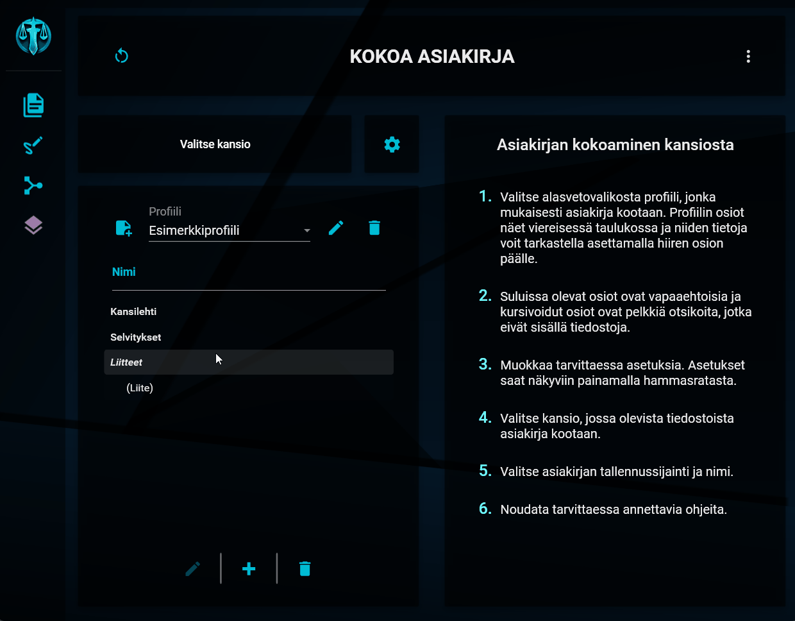

# Osioiden järjesteleminen

---

## Listan uudelleenjärjestäminen

Osioiden listan järjestäminen

Osioiden listasta näet profiiliin kuuluvat osiot. Tiedostot ja otsikot kootaan tuotettavaan asiakirjaan listassa näkyvässä järjestyksessä ja sen mukaisessa hierarkiassa.

Otsikot näytetään listassa _kursivoituna_ ja sellaiset tiedosto-osiot, jotka ovat vapaaehtoisia, on merkitty (sulkuihin).

Voit tarkastella osiota koskevia tarkempia tietoja leijuttamalla hiirtä haluamasi osion päällä.

Voit muuttaa osioiden keskinäistä järjestystä ja hierarkiaa tiedostolistassa seuraavilla tavoilla:

### Siirtäminen pystysuunnassa

Valitse haluamasi osio listasta ja liikuta sitä ylä- ja alasuuntaan painamalla samanaikaisesti pohjaan CTRL-näppäin sekä ylä- tai alanuolinäppäin. Osio siirretään edeltävän tai seuraavan _samantasoisen_ osion edelle tai sen jälkeen.

### Siirtäminen sivusuunnassa

Osioiden keskinäistä hierarkiaa saat muutettua painamalla vastaavasti samanaikaisesti pohjaan CTRL-näppäimen sekä vasemmalle tai oikealle osoittavan nuolinäppäimen. Siirto on mahdollista ainoastaan yhden tason edeltävää osiota sisemmäs. Toiseen suuntaan siirto on mahdollinen korkeimmalle ylätasolle saakka.

Osion siirtäminen hierarkiassa ei ole mahdollista, jos osio sisältää alatason osiota. Alatason osiot on ensin siirrettävä vähintään samalle tasolle siirrettävän osion kanssa (eli pois siirrettävän osion alta).

---

> "Stop that incessant clicking!" - Teron Gorefiend
