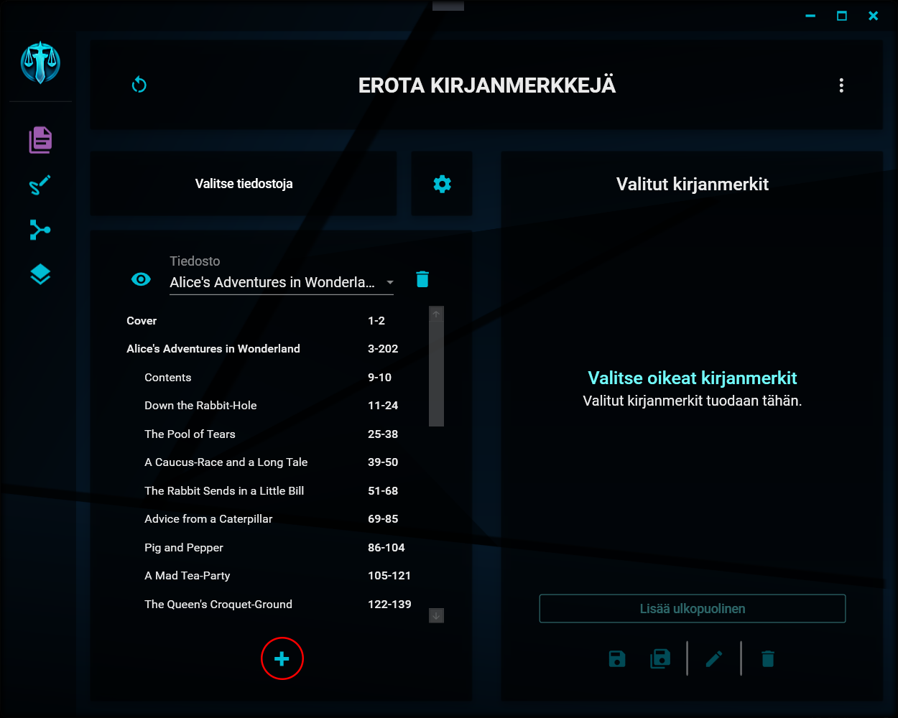
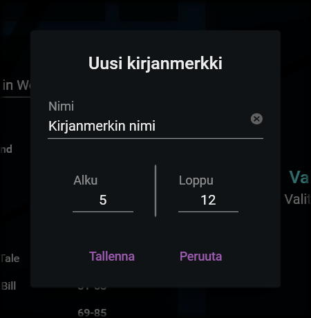

# Kirjanmerkin lisääminen

---

## Uuden kirjanmerkin painike

<details>
<summary>Uuden kirjanmerkin lisääminen</summary>
<div class="accordioncontent">



</div>
</details>

Uuden kirjanmerkin saat lisättyä asiakirjaan klikkaamalla kirjanmerkkilistauksen alapuolella olevaa +-painiketta.

## Uuden kirjanmerkin valinnat

<details>
<summary>Kirjanmerkin valinnat</summary>
<div class="accordioncontent">



</div>
</details>

Uuden kirjanmerkin tiedot saat syötettyä avautuvaan ikkunaan. Kaikki kentät ovat pakollisia ja niiden sisältö on seuraava:

### 1. Kirjanmerkin nimi

Tämä on nimi, joka näytetään kirjanmerkkilistauksessa ja joka lisätään eroteltaessa tiedoston (tai kirjanmerkin) nimeen, mikäli [paikanvaraaja](settings.md#1-nimen-rakenne) \[kirjanmerkki\] on nimen mallissa käytössä.

Kirjanmerkille on annettava jokin nimi - kenttä ei voi olla tyhjä.

### 2. Alku

Tämä on kirjanmerkin aloitussivu. Aloitussivu on myös se sivu, jolla kirjanmerkki sijaitsee.

Tämän arvon on oltava yli 0, eikä se saa olla suurempi, kuin loppusivu.

### 3. Loppu

Tämä on kirjanmerkin loppusivu, eli sen kattaman alueen viimeinen sivu. Pdf-tiedoston kirjanmerkkipuussa esiintyvä kirjanmerkki kattaa aina alueen, joka alkaa kyseisen kirjanmerkin alkusivusta ja päättyy seuraavan kirjanmerkin alkusivulle. Tässä syötettävä kirjanmerkki voi kuitenkin kattaa myös lyhyemmän tai pidemmän alueen.

_Esimerkki_

Asiakirjassa on kaksi kirjanmerkkiä ja ensimmäisen kirjanmerkin alle lisätään uusi kirjanmerkki seuraavasti:

```
Kirjanmerkki 1 (s. 1-10)
   Kirjanmerkki 2 (s. 5-7) <- Uusi kirjanmerkki
Kirjanmerkki 3 (s. 11-15)
```

Avattaessa kyseinen tiedosto pdf-editorilla ja eroteltaessa sieltä kirjanmerkin 2 mukainen sivualue, tuloksena olisi tiedosto, joka sisältäisi sivut 5-10. Pdf-tiedostoon sisältyvät kirjanmerkit eivät sisällä tietoa niiden loppusivusta, vaan sen oletetaan aina olevan seuraavan kirjanmerkin alkusivua edeltävä sivu.

Lisättäessä kirjanmerkki Opuksella ja eroteltaessa se sitä kautta, voidaan sivualue siis kuitenkin määrittää edeltävässä esimerkissä lyhyemmäksi. Opus tuottaisi tiedoston, joka sisältäisi vain sivut 5-7.

Loppusivun arvon on oltava yli 0, eikä se saa olla pienempi, kuin alkusivu.

## Tallentaminen

Uuden kirjanmerkin saa tallennettua painamalla Tallenna-painiketta. Kirjanmerkki lisätään automaattisesti [valittujen kirjanmerkkien luetteloon](selected_bookmarks.md), josta sen voi halutessaan myös [poistaa](modifying_selected_bookmarks.md#kirjanmerkin-poistaminen).

Kirjanmerkkiä ei lisätä alkuperäiseen tiedostoon, vaan sitä käytetään ainoastaan tässä yhteydessä.

---

> "When life gives you lemons, don't make lemonade. Make life take the lemons back! Get mad! I don't want your damn lemons! What am I supposed to do with these?! Demand to see life's manager! Make life rue the day it thought it could give Cave Johnson lemons! Do you know who I am?! I'm the man who's gonna burn your house down! With the lemons! I'm gonna get my engineers to invent a combustible lemon that burns your house down!" - Cave Johnson
