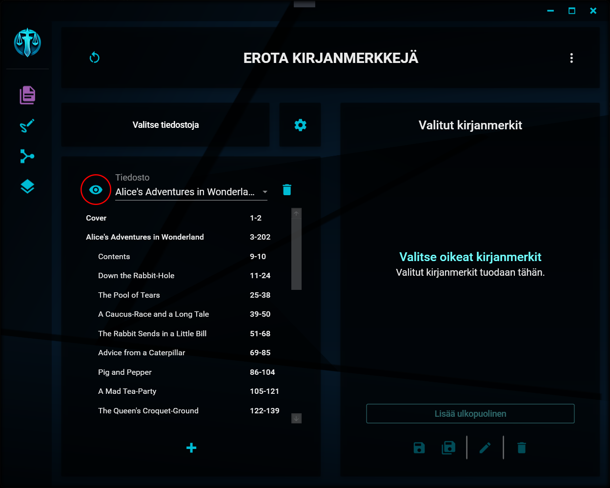

# Käsiteltävien tiedostojen valinnat

---

## Käsiteltävän tiedoston valitseminen

    
Tiedoston valinta

Ohjelmaan avaamistasi tiedostoista saat valittua käsiteltävän tiedoston näkymän vasemman laidan alasvetovalikosta. Valitessasi käsiteltävän tiedoston, sen sisältämät kirjanmerkit listataan alasvetovalikon alapuolella olevaan listaan.

    
Kirjanmerkkien listaus

## Tiedoston avaaminen tarkasteltavaksi

    
Tarkasteltavaksi avaaminen

Saat avattua käsiteltävän tiedoston tarkasteltavaksi järjestelmän oletussovelluksella klikkaamalla alasvetovalikon vasemmalla puolella olevaa silmän kuvaa. Tiedosto avataan ja voit lukea sitä normaalisti tai tehdä siihen haluamiasi merkintöjä (muista tallentaa, kun olet tehnyt merkinnät!).

## Tiedoston poistaminen listalta

    
Tiedoston poistaminen

Saat poistettua tuomasi tiedoston käsiteltävien tiedostojen listalta klikkaamalla alasvetovalikon oikealla puolella olevaa roskakorin kuvaa. Tiedosto poistetaan ainoastaan listalta, alkuperäinen tiedosto ei katoa sen sijaintipaikasta mihinkään.

Mikäli olet jo poiminut kyseisestä tiedostosta kirjanmerkkejä käsittelyyn, ne poistetaan [käsiteltävien kirjanmerkkien listalta](selected_bookmarks.md).

---

> "I used to be an adventurer like you. Then I took an arrow to the knee." - Town Guard
