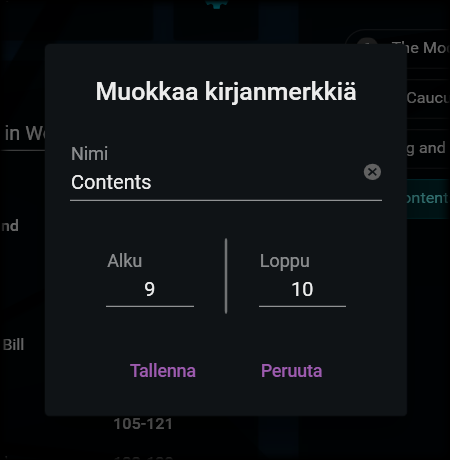
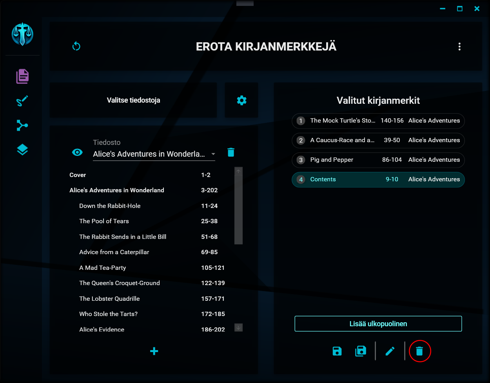

# Valittujen kirjanmerkkien muokkaaminen

---

## Kirjanmerkin muokkaamisen painike

    
Valitun merkin muokkaaminen

Valitun kirjanmerkin tietoja saat muokattua valitsemalla haluamasi kirjanmerkin [valittujen kirjanmerkkien luettelosta](selected_bookmarks.md) ja painamalla näkymän alalaidassa olevaa kynän kuvaa.

[Ulkopuolisen tiedoston merkintää](reordering_bookmarks.md#ulkopuolisen-tiedoston-merkinnän-lisääminen) ei ole mahdollista muokata, koska se ei sisällä muokattavia tietoja.

## Tietojen muokkaamisen valinnat

    
Tietojen muokkausikkuna

Valitun kirjanmerkin tietoja saat muokattua avautuvassa ikkunassa. Kaikki tiedot ovat pakollisia ja niitä koskevat samat ohjeet, kuin luotaessa [uutta kirjanmerkkiä](add_bookmark.md#uuden-kirjanmerkin-valinnat).

## Kirjanmerkin poistaminen

    
Kirjanmerkin poistamisen painike

Valitun kirjanmerkin saa poistettua valittujen kirjanmerkkien luettelosta valitsemalla sen ja klikkaamalla näkymän alalaidasta roskakorin kuvaa. Kirjanmerkki palautetaan [tiedostokohtaiseen kirjanmerkkiluetteloon](file_options.md#käsiteltävän-tiedoston-valitseminen) näkymän vasempaan laitaan (oikean tiedoston alle), josta sen voi [valita uudelleen](selecting_bookmarks.md#kirjanmerkkien-valitseminen).

Mikäli poistetaan ylätason merkki, kyseinen merkki ja kaikki sen alla olevat merkit palautetaan tiedostokohtaiseen luetteloon.

[Ulkopuolisen tiedoston merkinnän](reordering_bookmarks.md#ulkopuolisen-tiedoston-merkinnän-lisääminen) voi poistaa kuten muutkin merkit.

---

> “Waka Waka Waka” - Pacman
