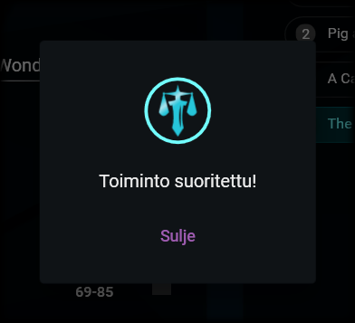

# Tallentaminen

---

## Tallentamisen tavat

Valittujen kirjanmerkkien mukaiset, tiedostoista eroteltavat sivualueet voi tallentaa kahdella eri tavalla:

### 1. Tallentaminen samaan tiedostoon

Sama tiedosto

Saat tallennettua valitut kirjanmerkit yhteen tiedostoon klikkaamalla näkymän alalaidassa olevaa, yhden levykkeen kuvaa. Windowsin tiedostopolun valintaikkuna aukeaa. Valitse siitä kansio, johon valmis tiedosto tallennetaan sekä anna tiedostolle nimi. Klikkaa sitten tallenna.

Lopputuote tallennetaan valitsemallasi nimellä valitsemaasi kansioon. Tiedosto sisältää kaikki valitsemiesi kirjanmerkkien mukaiset sivualueet kaikista valitsemistasi tiedostoista. Lopputuotteen sisällä kirjanmerkit on nimetty antamasi [nimen rakenteen](settings.md#1-nimen-rakenne) mukaan. Jos olet valinnut [ryhmittelemisen tiedoston mukaan](settings.md#5-järjestä-tiedostojen-mukaan), kirjanmerkit on ryhmitelty tiedostojen mukaan nimettyjen ylämerkkien alle.

### 2. Tallentaminen erillisiin tiedostoihin

Erilliset tiedostot

Erillisiin tiedostoihin voit tallentaa klikkaamalla näkymän alalaidassa olevaa, kahden levykkeen kuvaa. Windowsin kansiopolun valintaikkuna aukeaa. Valitse kansio, johon tiedostot tallennetaan.

Lopputuotteet tallennetaan valitsemaasi kansioon nimettynä antamasi [nimen rakenteen](settings.md#1-nimen-rakenne) mukaan. Mahdolliset eroteltaviin kirjanmerkkeihin sisältyvät alamerkit ovat mukana kussakin tiedostossa.

## Mahdolliset lisätiedot

Riippuen siitä, mitä asetuksia olet valinnut [erottelemisen asetuksista](settings.md#erottelun-asetukset-1), sinulta saatetaan erottelemisen aikana kysyä esimerkiksi seuraavia asioita:

- nimen rakenne
- zip-tiedoston nimi ja tallennuspaikka
- ne tekijät, joiden merkinnät poistetaan

Vastaa kysymyksiin, mikäli niitä esitetään.

## Ilmoitus valmistumisesta

Erottelun valmistuminen

Kun erottelu on valmis, siitä ilmoitetaan sinulle erillisellä ikkunalla. Voit nyt sulkea ikkunan ja tarkastaa tarvittaessa lopputuotteet. Saat aloitettua erottelun uudelleen alusta klikkaamalla [Aloita alusta -painiketta](../general/view_structure.md#1-aloita-alusta--painike).

---

> "A reminder to all Black Mesa personnel. Regular radiation and biohazard screenings are a requirement of continued employment in the Black Mesa Research Facility. Missing a scheduled urinalysis or radiation check-up is grounds for immediate termination. If you feel you have been exposed to radioactive or other hazardous materials in the course of your duties, contact your radiation safety officer immediately. Work safe, work smart. Your future depends on it." - Black Mesa Transit Announcement System
