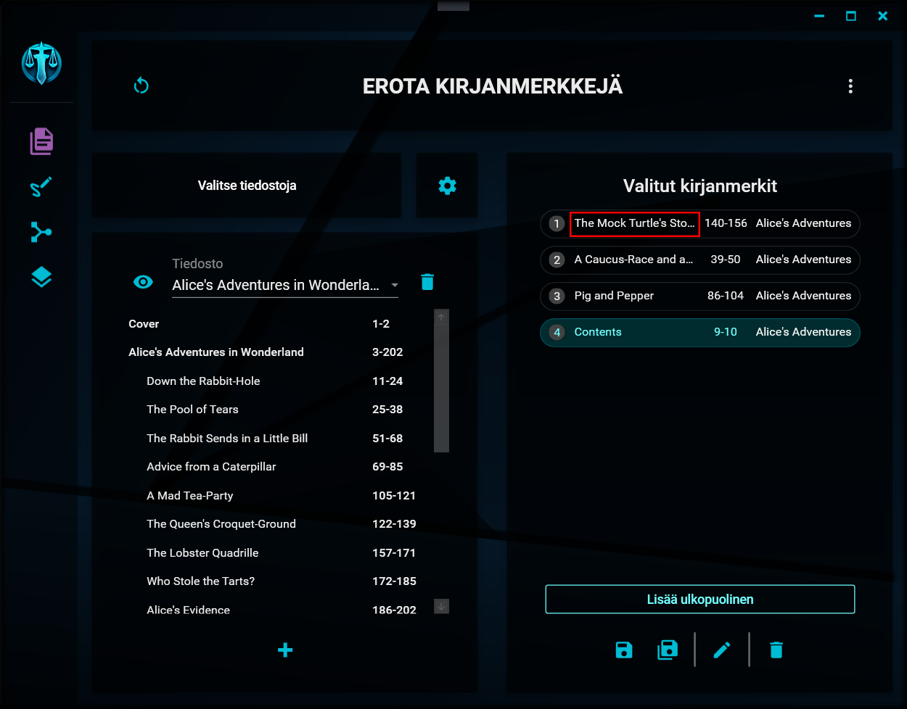
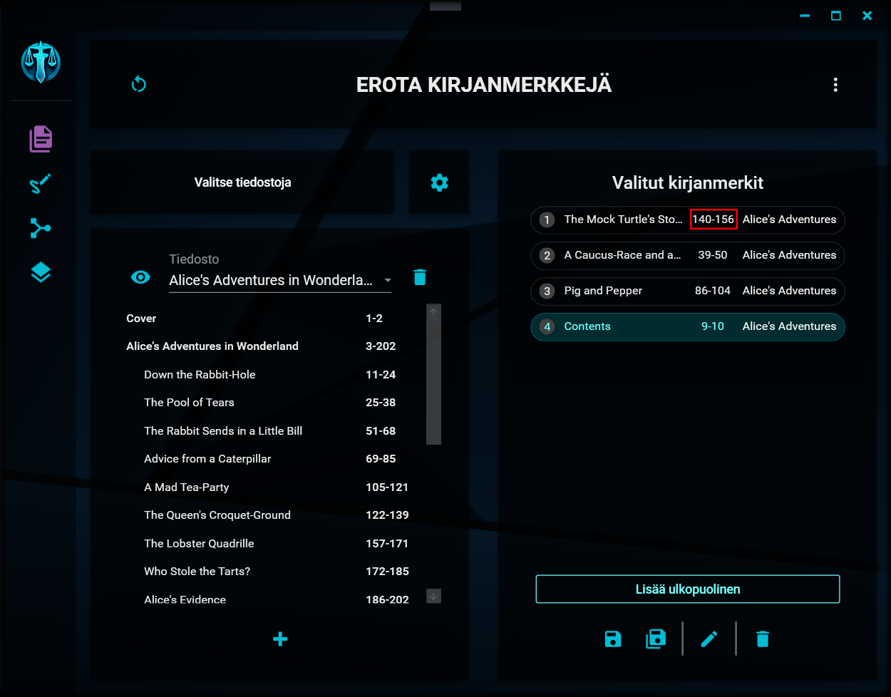
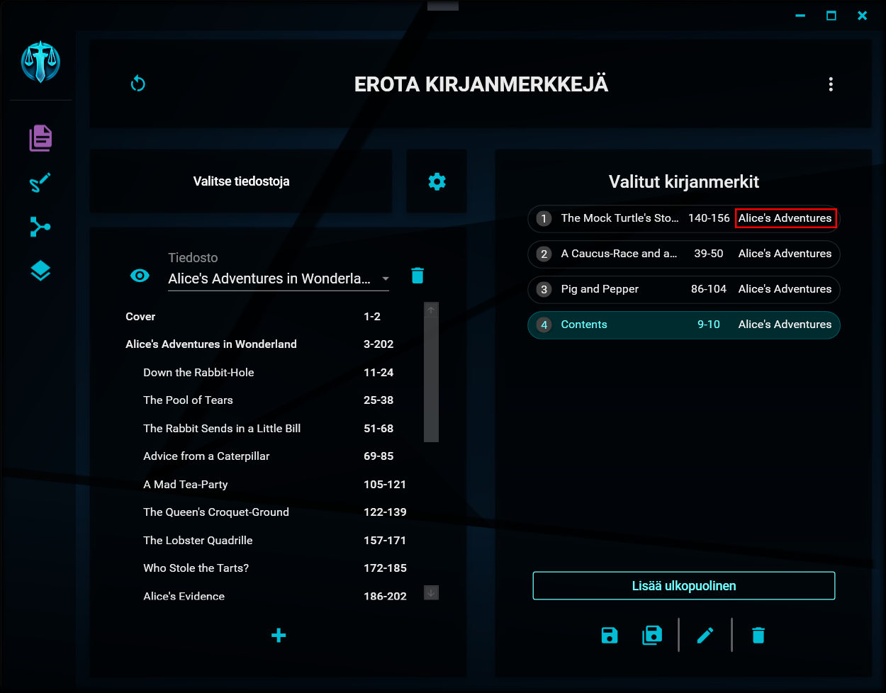

# Valittujen merkkien käsittely

---

Valittujen luettelo

Valitsemasi kirjanmerkit näkyvät näkymän oikean laidan luettelossa. Kyseiset kirjanmerkit eivät enää näy [tiedoston kirjanmerkkiluettelossa](file_options.md#käsiteltävän-tiedoston-valitseminen), jotta niitä ei voisi valita kahteen kertaan.

Kustakin kirjanmerkistä on näkyvissä seuraavat tiedot:

### 1. Järjestysluku

Kirjanmerkin järjestysluku

Tämä kertoo kirjanmerkin sijainnin valittujen kirjanmerkkien luettelossa. Numerot ovat siinä järjestyksessä, jossa kirjanmerkit listallakin ovat. Numeroinnin tarkoitus on ainoastaan helpottaa tietyn kirjanmerkin paikan hahmottamista nopeasti varsinkin silloin, kun kirjanmerkkejä on valittuna paljon.

Mikäli erottelun [nimen rakenteessa](settings.md#1-nimen-rakenne) on käytössä numeron paikanvaraaja \[numero\], korvataan se lopullisessa tiedoston nimessä tällä järjestysnumerolla (sekä tarpeen mukaan lisättävillä nollilla).

### 2. Nimi

Kirjanmerkin nimi

Tämä kohta näyttää valitun kirjanmerkin nimen.

Mikäli erottelun [nimen rakenteessa](settings.md#1-nimen-rakenne) on käytössä kirjanmerkin nimen paikanvaraaja \[kirjanmerkki\], korvataan se lopullisessa tiedoston nimessä tällä nimellä.

### 3. Sivuväli

Merkin sivuväli

Tämä kohta näyttää valitun kirjanmerkin alku- ja loppusivut, eli sen sivuvälin, jonka kirjanmerkki alkuperäisessä asiakirjassa kattaa. Kyseessä oleva väli on se, jonka mukaisesti sivut poimitaan lopulliseen tiedostoon.

### 4. Tiedoston nimi

Merkin tiedoston nimi

Tämä kohta näyttää sen tiedoston nimen, josta kirjanmerkki on valittu.

Mikäli erottelun [nimen rakenteessa](settings.md#1-nimen-rakenne) on käytössä tiedoston nimen paikanvaraaja \[tiedosto\], korvataan se lopullisessa tiedoston nimessä tällä nimellä.

---

> "But there's no sense crying  
> over every mistake.  
> You just keep on trying  
> 'till you run out of cake.  
> And the science gets done  
> and you make a neat gun  
> for the people who are  
> still alive." - GLaDOS (Jonathan Coulton), Still Alive
