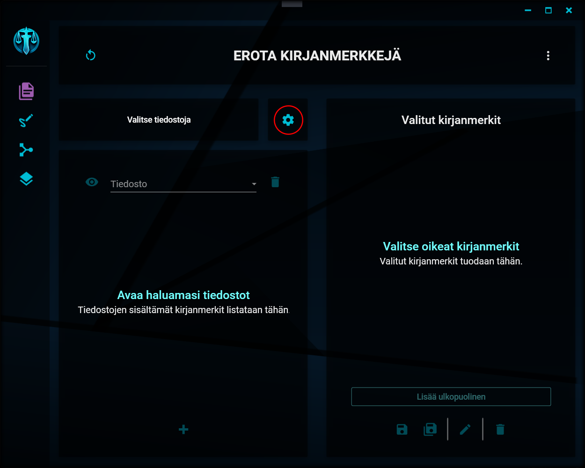

# Erottelun asetukset

---

## Asetusten avaaminen

<details>
<summary>Asetusten painike</summary>
<div class="accordioncontent">



</div>
</details>

Erottelua koskevat asetukset saat avattua klikkaamalla näkymän keskivaiheilla olevaa hammasratasta.

## Erottelun asetukset

<details>
<summary>Asetusikkuna</summary>
<div class="accordioncontent">


</div>
</details>

Erottelua koskien voit muokata seuraavia asetuksia:

### 1. Nimen rakenne

Tämä asetus määrittää sen, miten erottelun tuloksena syntyvät tiedostot nimetään. Tähän kirjoitettu teksti annetaan tiedostojen (tai yhteen tiedostoon sisältyvien kirjanmerkkien) nimeksi. Mikäli kansioon tallennetaan samannimisiä tiedostoja, niiden perään lisätään järjestysluku.

```
"tiedosto1.pdf", "tiedosto2.pdf", "tiedosto3.pdf", jne.
```

Nimeämiskentässä voi käyttää seuraavia paikanvaraajia:

- \[kirjanmerkki\]
- \[numero\]
- \[tiedosto\]

Paikanvaraajista voi käyttää myös niiden englanninkielisiä vastineita (bookmark, number, file). Paikanvaraajat on kirjoitettava tekstiin hakasulkeiden sisään.

Kun lopulliset tiedostot nimetään, paikanvaraajat korvataan niiden osoittamalla sisällöllä seuraavasti:

- kirjanmerkki -> Kyseisen kirjanmerkin nimi.
- numero -> Juokseva numerointi eroteltavien kirjanmerkkien järjestyksessä. Numeroon lisätään nollia niin, että numeroiden määrä on jokaisen nimen osalta sama (esim. 01, 02, 03 ... 11, 12, 13 ... nn).
- tiedosto -> kyseessä olevan tiedoston nimi.

_Esimerkki_

Asetuksiin on nimeämisen malliksi kirjattu "Asiakirja \[numero\], nimeltä \[kirjanmerkki\]".
Erotetaan kolme kirjanmerkkiä samasta tiedostosta. Lopputuloksena ovat seuraavasti nimetyt tiedostot:

```
"Asiakirja 1, nimeltä tiliote", "Asiakirja 2, nimeltä laskut" ja "Asiakirja 3, nimeltä kuvat"
```

### 2. Kysy aina erikseen

Mikäli tämä asetus laitetaan päälle, kysytään nimen mallia jokaisen erottelun yhteydessä aina erikseen. Oletusarvoksi annetaan asetuksiin kirjattu nimen malli.

### 3. Muunna pdf/a-muotoon

Mikäli tämä asetus valitaan, muunnetaan lopputuloksena tuotettavat pdf-tiedostot arkistokelpoiseen pdf/a-muotoon.

_HUOM!_ Tämän ominaisuuden käyttäminen vaatii PDF-Tools -ohjelmiston olemassaoloa oletusarvoisessa asennussijainnissa Program Files -kansiossa. Mikäli ohjelmistoa ei löydy, tätä asetusta ei voi laittaa päälle.

### 4. Pakkaa zip-tiedostoon

Mikäli tämä asetus laitetaan päälle, lopputuloksena tuotettavat pdf-tiedostot pakataan lopuksi zip-muotoiseen tiedostoon. Zip-tiedoston tallennussijaintia kysytään erikseen.

### 5. Järjestä tiedostojen mukaan

Mikäli tämä asetus valitaan ja valitaan kirjanmerkit tallennettavaksi _yhteen tiedostoon_, luodaan tiedostoon yläkirjanmerkit niiden tiedostonimien mukaan, joista kirjanmerkit erotellaan. Tämän jälkeen kirjanmerkit ryhmitellään uudelleen nimettyinä kyseisten yläkirjanmerkkien alle.

_HUOM!_ Tämä asetus ei koske erottelua erillisiin tiedostoihin.

### 6. Merkinnät

Tämä valinta määrittää sen, mitä pdf-tiedostoissa oleville merkinnöille (kommenteille) tehdään erotelluissa tiedostoissa. Valintamahdollisuuksia on kolme:

1. _Pidä kaikki_. Kaikki merkinnät säilytetään sellaisina, kuin ne ovat alkuperäisissä tiedostoissa.
2. _Poista valitut_. Sinulta kysytään erikseen, keiden tekijöiden kommentit lopputuotteista poistetaan.
3. _Poista kaikki_. Kaikki asiakirjoista löytyvät merkinnät poistetaan lopputuotteista.

---

> "Thank you, Mario! But our Princess is in another castle!" - Toad
