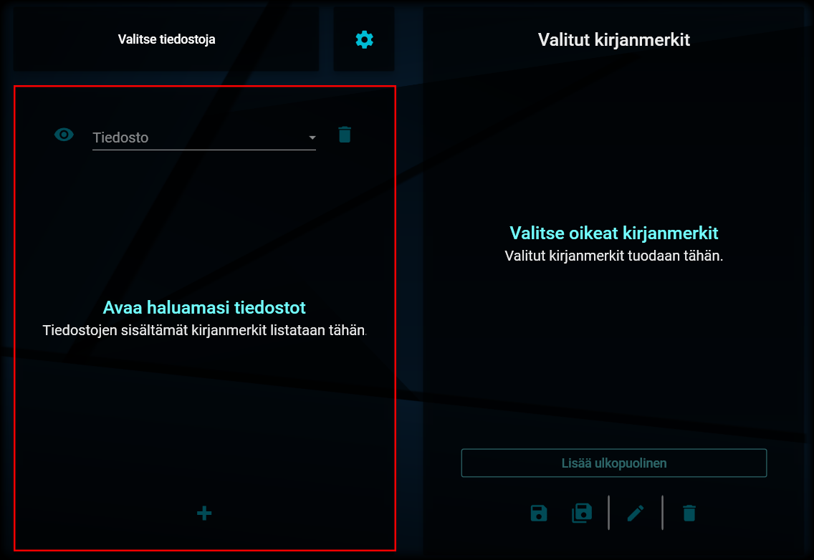
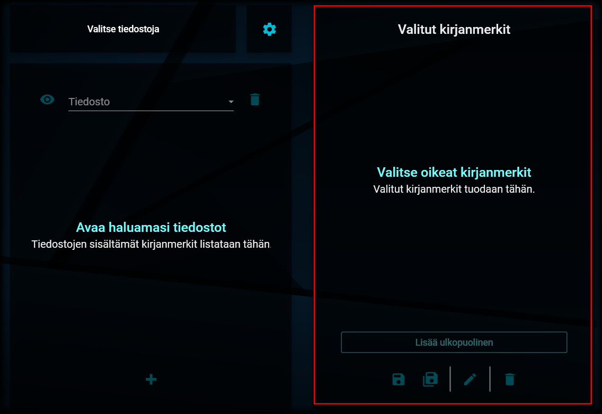

# Näkymän rakenne

---

## Päänäkymä

Päänäkymän rakenne

Sovelluksen päänäkymä koostuu kuudesta eri osiosta, jotka on kuvattu seuraavana.

## Päävalikko

Päävalikko

Vasemman laidan päävalikosta voit valita haluamasi toiminnon klikkaamalla sitä koskevaa painiketta. Painikkeen väri muuttuu, kun se on valittuna. Kyseiselle toiminnolle tekemäsi asetukset ja muutokset säilyvät, vaikka vaihtaisit välillä toiseen toimintoon.

## Yläpalkki

Yläpalkista löydät seuraavat kolme erillistä osiota:

### 1. Aloita alusta -painike

Aloita alusta

Kyseistä painiketta painamalla saat nollattua näkyvillä olevan toiminnon ja aloitettua sen suorittamisen alusta.

Jos olet esimerkiksi erottelemassa kirjanmerkkejä ja haluatkin aloittaa alusta tyhjentäen kummatkin listat niille valikoiduista tiedostoista ja kirjanmerkeistä, voit painaa Aloita alusta -painiketta ja valita uudelleen ne tiedostot, joita haluat työstää.

### 2. Toiminnon otsake

Otsake

Tämä otsake kertoo sen, mitä toimintoa olet kulloinkin käyttämässä.

### 3. Yleisten toimintojen valikko

Yleiset toiminnot

Painamalla tämän valikon avauspainiketta, pääset tarkastelemaan yleisiä, koko sovelluksen laajuisia linkkejä ja asetuksia. Valikko sisältää seuraavat valinnat:

**a. Käyttöohje**

Tätä linkkiä klikkaamalla pääset näihin käyttöohjeisiin.

**b. Lisenssit**

Tästä linkistä avautuvat tiedot sovelluksen ja siihen kuuluvien, viitattujen kirjastojen lisenssitiedot.

**c. Lähdekoodi**

Linkkiä klikkaamalla pääset tarkastelemaan sovelluksen lähdekoodia (Opus on avoimen lähdekoodin sovellus).

**d. Kieli**

Kielivalikosta pääset vaihtamaan sovelluksen käyttöliittymän kieltä. Tällä hetkellä valittavana ovat:

- Suomi
- Ruotsi
- Englanti

Kielivalinta astuu voimaan, kun sovellus käynnistetään uudelleen.

**e. Lokitustaso**

Tästä pääset valitsemaan sen tason, jolla ohjelmasta tallennetaan tietoa lokitiedostoon. Valintaa ei tarvitse muuttaa, ellei siihen erikseen kehoteta tuen toimesta.

## Tiedostonvalitsin

Tiedostojen ja kansioiden valinta

Tällä painikkeella tuodaan kunkin toiminnallisuuden osalta sovelluksen tietoon ne tiedostot tai kansiot, joita on tarkoitus käsitellä.

## Asetukset

Asetusten valinta

Asetuksista kullekin toiminnallisuudelle voidaan asettaa sen toiminnan kannalta olennaiset valinnat.

## Toiminnot 1

Toiminnot 1

Tässä näkymässä voidaan toteuttaa kunkin toiminnallisuuden kannalta keskeisiä toimintoja (esim. kirjanmerkkien valitseminen tai yhdistettävien tiedostojen järjestäminen).

## Toiminnot 2

Toiminnot 2

Tässä näkymässä voidaan toteuttaa lisää toiminnallisuuden kannalta keskeisiä toimintoja (esim. kirjanmerkkien järjestäminen erottelua varten). Mikäli tätä näkymää ei toiminnon osalta ole tarvetta käyttää toiminnallisuuksiin, näytetään tässä näkymässä lyhyet ohjeet toiminnon käyttämiseen.

---

> "Collecting evidence had gotten old a few hundred bullets back." - Max Payne
