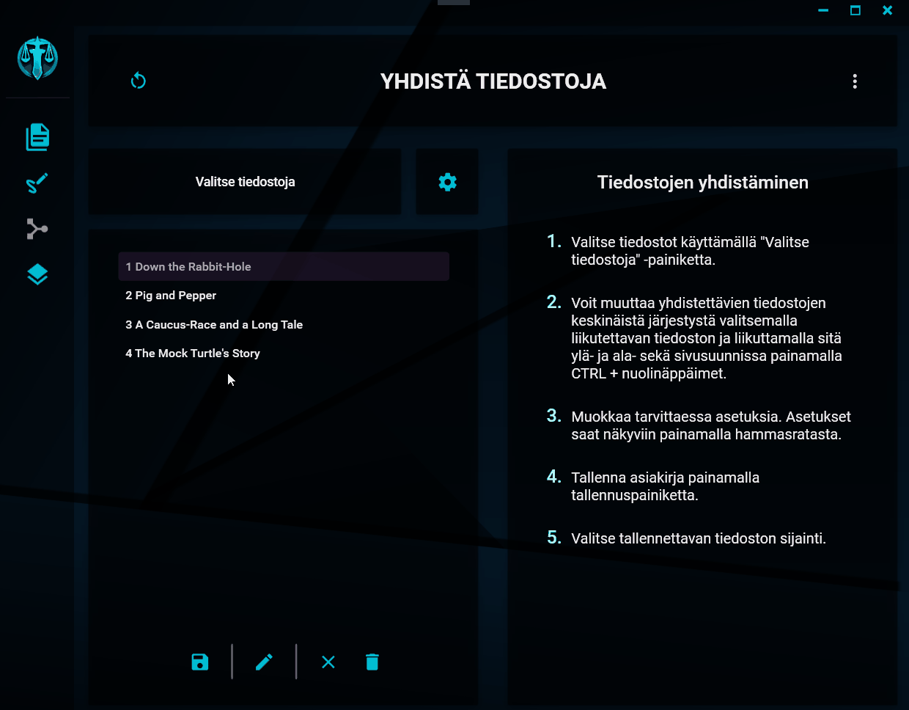
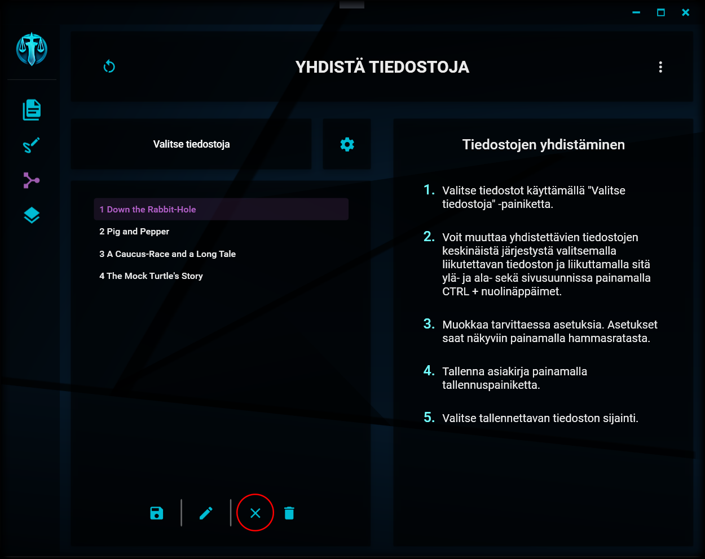

# Valintojen muokkaaminen

---

# Järjestyksen muuttaminen

Järjestyksen muuttaminen

Voit muuttaa valitsemiesi tiedostojen keskinäistä järjestystä ja hierarkiaa tiedostolistassa seuraavilla tavoilla:

## Siirtäminen pystysuunnassa

Valitse haluamasi tiedosto listasta ja liikuta sitä ylä- ja alasuuntaan painamalla samanaikaisesti pohjaan CTRL-näppäin sekä ylä- tai alanuolinäppäin. Tiedosto siirretään edeltävän tai seuraavan _samantasoisen_ kirjanmerkin edelle tai sen jälkeen.

## Siirtäminen sivusuunnassa

Tiedostojen keskinäistä hierarkiaa saat muutettua painamalla vastaavasti samanaikaisesti pohjaan CTRL-näppäimen sekä vasemmalle tai oikealle osoittavan nuolinäppäimen. Siirto on mahdollista ainoastaan yhden tason edeltävää tiedostoa sisemmäs. Toiseen suuntaan siirto on mahdollinen korkeimmalle ylätasolle saakka.

Tiedoston siirtäminen hierarkiassa ei ole mahdollista, jos tiedosto sisältää alatason tiedostoja. Alatason tiedostot on ensin siirrettävä vähintään samalle tasolle siirrettävän tiedoston kanssa (eli pois siirrettävän tiedoston alta).

## Järjestyksen ja hierarkian vaikutus

Tuodut tiedostot yhdistetään lopputuotteeseen siinä järjestyksessä, johon ne on tiedostolistassa järjestetty. Niille luodaan lopputuotteeseen kirjanmerkit, joiden hierarkia on listan mukainen (eli listassa toisen tiedoston alle sisennetyt tiedostot lisätään alikirjanmerkeiksi kirjanmerkkiluetteloon).

## Tietojen muokkaaminen

Valinnan tietojen muokkaaminen

Yksittäisen tuodun tiedoston tietoja saat muokattua valitsemalla haluamasi tiedoston listalta ja painamalla näkymän alalaidassa olevaan kynän kuvaa. Muokkausikkuna aukeaa.

Tietojen muokkaamisen valinnat

Valitun tiedoston nimeä saat muokattua avautuvassa ikkunassa. Nimi ei voi olla tyhjä, mutta sillä ei ole muita vaatimuksia. Kyseisellä nimellä luodaan kirjanmerkki lopputuotteena tuotettavaan asiakirjaan.

Alkuperäiseen tiedostoon nimen muutos ei vaikuta.

## Tiedostojen poistaminen listalta

Tiedoston poistaminen

Yksittäisen tiedoston saat poistettua listalta valitsemalla sen ja painamalla näkymän alalaidassa olevaa roskakorin kuvaa. Tiedosto poistetaan listalta ja sillä mahdollisesti olevat alatiedostot palautetaan vasempaan laitaan.

## Listan tyhjentäminen

Koko listan tyhjentäminen

Koko tiedostolistan saat tyhjennettyä painamalla näkymän alalaidassa olevaa rastin kuvaa.

---

> "A city beneath the ocean?.... Ridiculous." - Booker DeWitt
