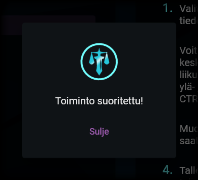

# Tallentaminen

---

## Yhdistettyjen tiedostojen tallentaminen

Tallentaminen

Lopullisen tiedoston saat tallennettua painamalla näkymän alalaidassa olevaa levykkeen kuvaa. Windowsin tiedostopolun valintaikkuna aukeaa. Valitse kansio, johon tiedosto tallennetaan, ja anna sille nimi. Klikkaa sitten tallenna.

## Imoitus valmistumisesta

Ilmoitus yhdistämisen valmistumisesta

Kun tiedostojen yhdistäminen on valmistunut, siitä ilmoitetaan sinulle erillisellä ikkunalla. Voit nyt sulkea ikkunan ja tarkastaa tarvittaessa lopputuotteen. Saat aloitettua yhdistämisen uudelleen alusta klikkaamalla [Aloita alusta -painiketta](../general/view_structure.md#1-aloita-alusta--painike).

---

> "You better go now so you won't have to run with your head as your third leg." - Ahti
