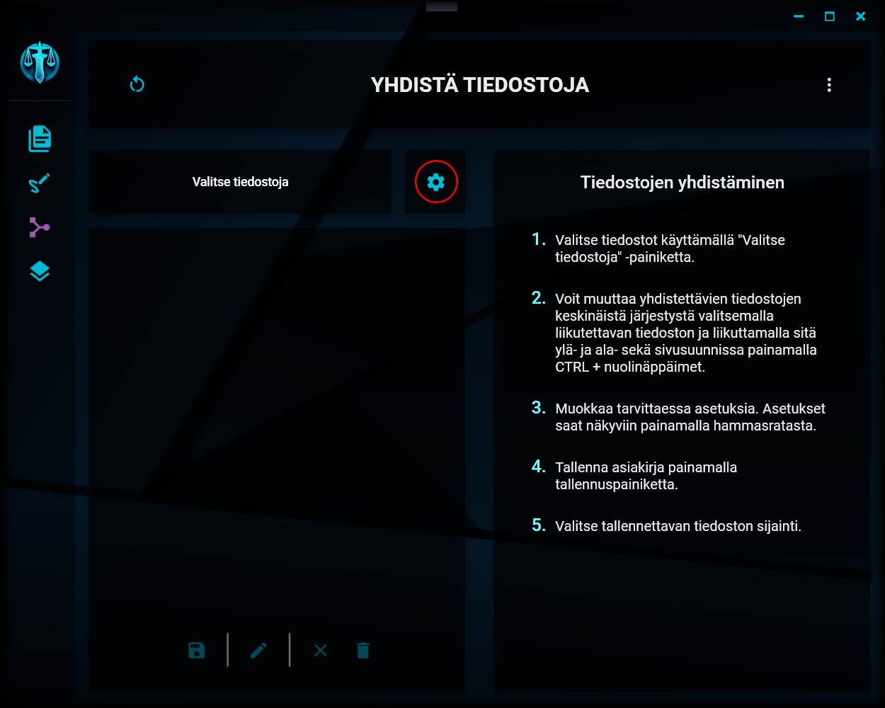
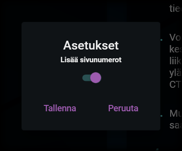

# Tiedostojen yhdistämisen asetukset

---

## Asetusten avaaminen

Asetusten painike

Tiedostojen yhdistämistä koskevat asetukset saat avattua klikkaamalla näkymän keskivaiheilla olevaa hammasratasta.

## Tiedostojen yhdistämisen asetukset

Asetusikkuna

Tiedostojen yhdistämistä koskien voit valita, lisätäänkö valmiiseen tiedostoon uudet sivunumerot. Muita asetuksia tässä yhteydessä ei ole.

---

> "There is a tranquilizer gun in the shark cage, but I'm not sure it would work on this species … you're welcome to try." - Black Mesa Scientist
