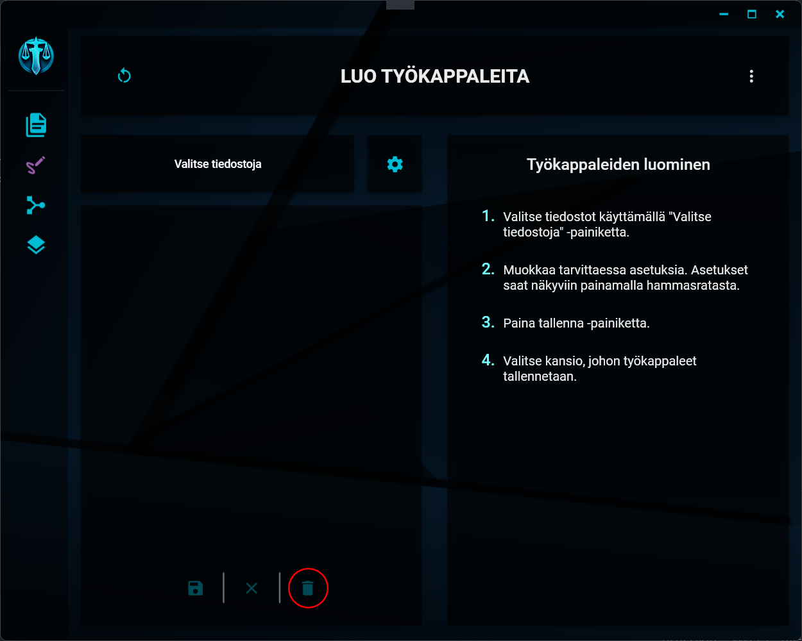
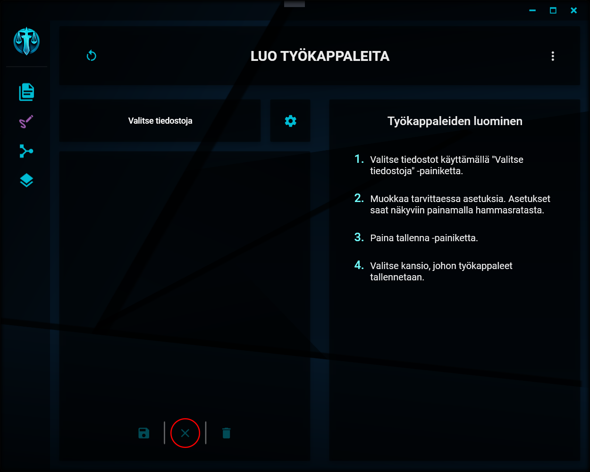

# Valintojen muokkaaminen

---

## Yksittäisen tiedoston poistaminen listalta

    
Tiedoston poistaminen

Saat poistettua tuomasi tiedoston käsiteltävien tiedostojen listalta klikkaamalla näkymän alaosassa olevaa roskakorin kuvaa. Tiedosto poistetaan ainoastaan listalta, alkuperäinen tiedosto ei katoa sen sijaintipaikasta mihinkään.

## Listan tyhjentäminen

    
Listan tyhjentäminen

Saat tyhjennettyä koko käsiteltävien tiedostojen listan klikkaamalla näkymän alaosassa olevaa rastin kuvaa.

---

> "..." - Gordon Freeman
