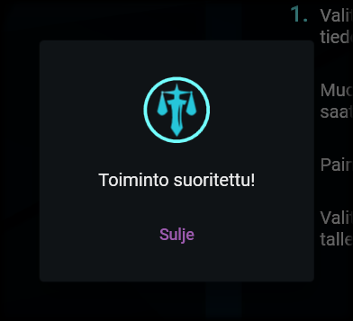

# Tallentaminen

---

## Työkappaleiden tallentaminen

Työkappaleet

Saat tallennettua valitsemasi tiedostojen työkappaleet klikkaamalla näkymän alalaidassa olevaa levykkeen kuvaa. Windowsin kansiopolun valintaikkuna aukeaa. Valitse siitä kansio, johon työkappaleet tallennetaan. Klikkaa sitten tallenna.

Tiedostot tallennetaan valitsemaasi kansioon allekirjoitus purettuna ja nimettynä asetuksissa annetun [nimen rakenteen](settings.md#1-nimen-rakenne) mukaan. Mikäli olet asetuksissa valinnut [hävitysmerkintöjen kiinnittämisen](settings.md#2-hävitysmerkintöjen-kiinnittäminen), ne on lopputuotteissa muutettu punaisiksi laatikoiksi.

## Ilmoitus valmistumisesta

Ilmoitus tallentamisen valmistumisesta

Kun työkappaleiden luominen on valmistunut, siitä ilmoitetaan sinulle erillisellä ikkunalla. Voit nyt sulkea ikkunan ja tarkastaa tarvittaessa lopputuotteet. Saat aloitettua työkappaleiden luomisen uudelleen alusta klikkaamalla [Aloita alusta -painiketta](../general/view_structure.md#1-aloita-alusta--painike).

---

> "Join the army, they said. See the world, they said. I'd rather be sailing." - Footman
