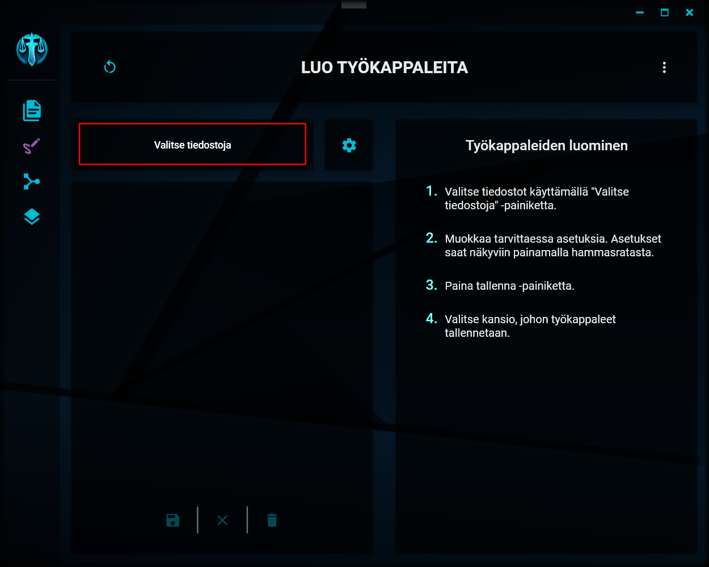

# Tiedostojen tuominen

---

    
Tiedostojen valitseminen käsiteltäväksi

Voit valita asiakirjat, joista työkappaleet luodaan, klikkaamalla "Valitse tiedostoja" -painiketta.

Windowsin tiedostonvalintaikkuna aukeaa. Voit valita kerralla yhden tai useamman tiedoston, jotka tuodaan käsiteltävien tiedostojen listaan.

---

> “Tell me Bats. What are you scared of? Failing to save this cesspool of a city? Not finding the Commissioner in time? Me, in a thong?” - Joker
